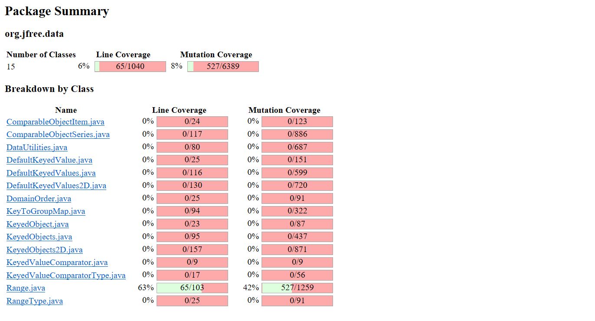
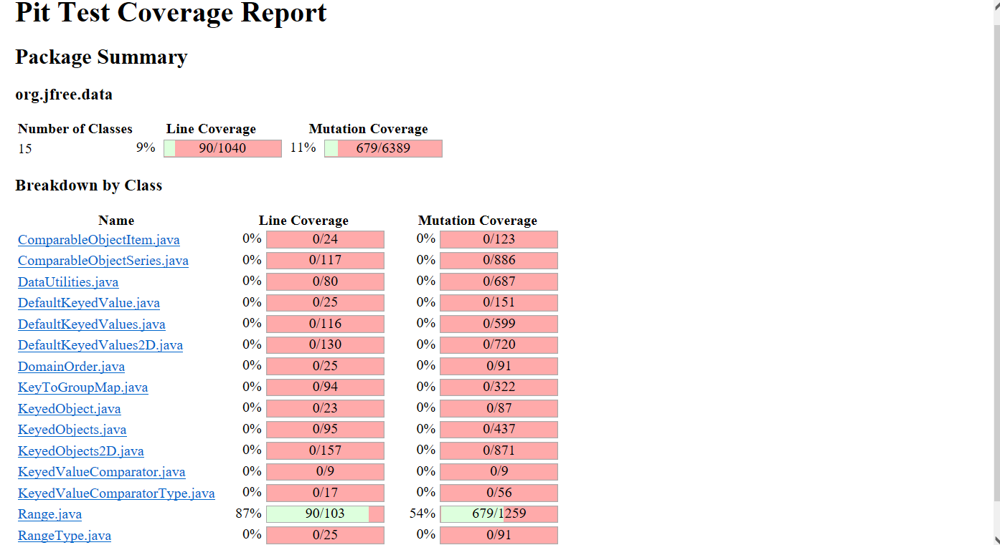
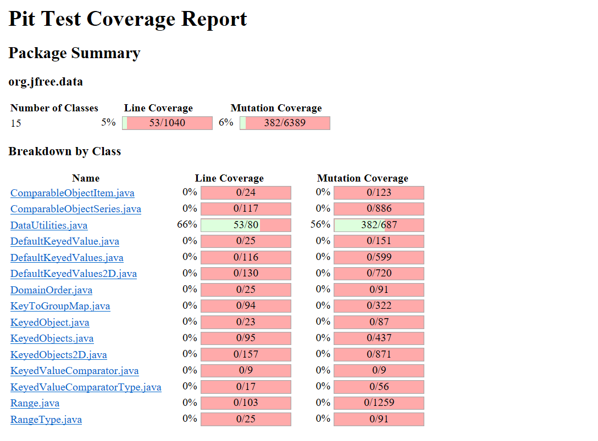

<!-- Output copied to clipboard! -->

<!-----

Yay, no errors, warnings, or alerts!

Conversion time: 0.569 seconds.

Using this Markdown file:

1. Paste this output into your source file.
2. See the notes and action items below regarding this conversion run.
3. Check the rendered output (headings, lists, code blocks, tables) for proper
   formatting and use a linkchecker before you publish this page.

Conversion notes:

* Docs to Markdown version 1.0β33
* Fri Mar 18 2022 15:24:22 GMT-0700 (PDT)
* Source doc: SENG 438 Assignment 1 Report
* Tables are currently converted to HTML tables.
----->

**SENG 438 Assignment 3 Report	**

**Group: (18)**

<table>
  <tr>
   <td>
    Sr.
   </td>
   <td>
    Name
   </td>
   <td>
    UCID
   </td>
  </tr>
  <tr>
   <td>
    1.
   </td>
   <td>
    Ali Siddiqi
   </td>
   <td>
    30092156
   </td>
  </tr>
  <tr>
   <td>
    2.
   </td>
   <td>
    Jay Gurjar
   </td>
   <td>
    30096042
   </td>
  </tr>
  <tr>
   <td>
    3.
   </td>
   <td>
    Kai Wang
   </td>
   <td>
    30002810
   </td>
  </tr>
  <tr>
   <td>
    4.
   </td>
   <td>
    Mohamed Numan
   </td>
   <td>
    30086940
   </td>
  </tr>
</table>

**SENG 438 GROUP**

**Mutation: initial console**

**Introduction**

This lab is used to familiarize students with generic code coverage methods. EclEmma was used as the code coverage tool which most of us had installed from Assignment 2. We decided to use the same approach as we did in Assignment 2. We decided that half of us would be on the Range and the other half on Data. Utilities. Most of our previous code had over 50% coverage and we added test cases to Range and Data Utilities to get the desired percentage. Each team later checked on each other to ensure the test cases were satisfactory and we also asked each other questions throughout the process. We learned that dividing group work into teams and checking on each other works really well for us and allows us to complete the assignments easily and quickly.  

**Introduction Analysis of 10 Mutants of the Range class **

**Mutant 1: contains()**

This produced a mutant of org/free/data/chart/util/ParamChecks::nullNotPermitted

Status: Killed

Analysis: The test in RangeTest.java which tested null objects deals with the null Mutant created by PIT, showing the null mutant has been killed. 

**Mutant 2: constrain()**

This test produced a mutant when positive infinity was passed to the constrain method. 

Status: Killed

Analysis: The test in RangeTest.java which tested if PositiveInfinity is in range of (-1,1) covers the mutant created by PIT. And therefore, the Positive infinity mutant gets handled by this test case.

**Mutant 3: getCentralValue()**

The mutant changed lower from 2 to 1.

Status: Killed

Analysi: The test suite tested values between -1 and 1, and therefore this mutant was killed by the original test suite. The mutant generated only changed initial values and therefore, the mutant gets killed/handled. 

**Mutant 4: getLowerBound()**

 This mutant replaces the return value with 0.0 instead of the lowerBound.

Status: Killed 

This mutant was killed with our original test suite as we had a test for the function getLowerBound() with the range -1,1. By returning 0.0 our test caught it as we were expecting it to return -1.

**Mutant 5: combine()**

The mutant replaces 1.3 to 5. 

Status: Killed

The mutant generated by PIT is handled by our original test suite since the value PIT changed to is also a double. And therefore, it kills the mutant which was generated. 

**Mutant 6: geaterThanToLessOrEqual**

This mutant changes the boolean return from 'return (value >= this.lower && value &lt;= this.upper);' to 'return (value &lt;= this.lower && value &lt;= this.upper).

Status: Killed

Analysis:  This mutant will be killed by our test case that has a range of -1 to 1 with a value equal to 0 because originally this return will be true but with the mutant value &lt;= this.lower will be false. Since the mutant will be false and not the expected truth it will be killed.

**Mutant 7: negated conditional **

This mutant will negate the allowZeroCrossing boolean. i.e if the boolean is false it will make it true and vice versa. 

Status: Survived

Analysis: Since we did not test the shift function extensively this mutant was not killed.

**Mutant 8: (add three mutants Kai)**

 

**Report all the statistics and the mutation score for each test class**

Our range test initially had 42% mutation coverage. 

After adding test cases, we increased Range mutation coverage to 54%.

Our initial DataUtilites had % mutation coverage.

.PNG)

After adding test cases, we increased mutation coverage to %.

**Analysis drawn on the effectiveness of each of the test classes **

**A discussion on the effect of equivalent mutants on mutation score accuracy **

**A discussion of what could have been done to improve the mutation score of the test suites **

We developed test cases so the mutations could be killed. Through developing such tests we were able to increase the mutation test score. A common source of mutations was from boundary testing as well as the variables found in the complex decision statements where multiple decisions were nested. To further improve the mutation test score, more tests can be added for the boundary and nested decision statements as well to ensure the most number of mutations are killed. 

**Why do we need mutation testing? Advantages and disadvantages of mutation testing**

Mutation testing further verification of the test suite. It allows for external changes to code that shows the tests can handle such external changes through bug injection. If the test suite can identify the new bugs injected then it goes to show that the test suite is robust and effective. 

Some advantages of mutation include:

*  a way to measure quality of the test cases written
* Find if test suite can handle bug injection
* A way to know that the testing is robust enough and can stop testing further
* Shows a way to know to what extent the SUT has been tested and allows for comprehensive results

Disadvantages of mutation testing include: 

1. The testing is complex and takes time to complete 
2. To write the test, knowledge is needed about the original code
3. Takes time to run the tests and also analysis of it also takes a lot of time

** Explain your SELENIUM test case design process **

We selected two different websites which were [https://bestbuy.ca/](https://bestbuy.ca/) and [https://walmart.ca/](https://walmart.ca/). 

Functionalities explored were:

1. Test For Searching products
    1. Searching for a existing product
    2. Searching for non existing product
2.  Tests for Adding products to the cart
    3. Adding one product to a cart
    4. Adding multiples quantities of a product
3.  	
4. 

**Explain the use of assertions and checkpoints how did you test each functionality with different test data**

Assertions were used to ensure that the expected outcomes match the actual value and that the end is the correct state. The checkpoints were used for when a longer path was taken and that the path is correct before running the specified test. Checkpoints were used to verify the loading of the pages, testing different web page functionality and the end state. 

** Discuss advantages and disadvantages of Selenium vs. Sikulix **

Selenium is able to work with more languages such as Java that work with Junit Tests to develop a full test suite. Selenium’s IDE was also more easy to work with and understand as compared to Sikulix. An advantage of Skiulix over selenium is how easy it is to take screenshots. 

**Teamwork/effort division:**

We decided that half of us would be on the Range and the other half on Data Utilities. Everyone ran the selenium tests through. Each pair of teams completed the code coverage for each section. We then wrote added test cases to get the desired coverage. Each team later checked on each other to ensure the test cases were satisfactory and we also asked each other questions throughout the process. 

**Difficulties Encountered**

Developing unit tests to get high code coverage. Also setting up the lab was also difficult.

**Lessons Learned**

We learned how to increase mutation coverage and understand the different mutations that can occur. We also learned how to write efficient test cases that will kill such mutations.

**Comments and Feedback**

In the lab, we got the chance to learn more about different methods of code coverage test cases and how it's important to have good test coverage especially. All in all, an interesting lab to do. 
